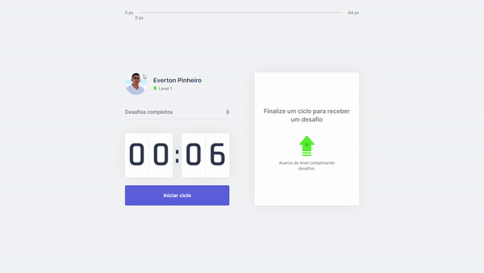

<h1 align="center">
  
</h1>

<p align="center">
  <a href="#-project">Project</a>&nbsp;&nbsp;&nbsp;|&nbsp;&nbsp;&nbsp;
  <a href="#-technologies">Technologies</a>&nbsp;&nbsp;&nbsp;|&nbsp;&nbsp;&nbsp;
  <a href="#-preview">Preview</a>&nbsp;&nbsp;&nbsp;|&nbsp;&nbsp;&nbsp;
  <a href="#-layout">Layout</a>&nbsp;&nbsp;&nbsp;|&nbsp;&nbsp;&nbsp;
  <a href="#-getting-started">Getting started</a>&nbsp;&nbsp;&nbsp;
</p>

<p align="center">
  <a href="https://www.linkedin.com/profile/evertonpinheiroti">
    
  </a>
  
  <a href="https://github.com/TIEverton/tindev/stargazers">
    
  </a>
</p>

<br>

<p align="center">
  
</p>

## 💻 Project

Move.it is an app that uses a Pomodoro technique with physical exercises for those who spend a lot of time in front of the computer.

## ✨ Technologies

This project was developed using the following technologies:

- [Next.js](https://nextjs.org/)
- [React](https://reactjs.org)
- [TypeScript](https://www.typescriptlang.org/)

## 🔥 Preview

[](https://moveit-next-three-mu.vercel.app/)

## 🔖 Layout

You can view the layout of the project through [this link](https://www.figma.com/file/ge20pu3ofMOKoliUyKx1Nl/Move.it-1.0). You must have an account at [Figma] (http://figma.com/) to access it.

## 🚀 Getting started

Clone the project and access the folder

```bash
$ git clone https://github.com/TIEverton/moveit.git && cd moveit
```

Follow the steps below

```bash
# Install the dependencies
$ yarn

# Start the project
$ yarn dev
```

Agora você pode acessar [`localhost:3000`](http://localhost:3000) do seu navegador.

---

Feito com ♥ by Everton Pinheiro 👋🏻 